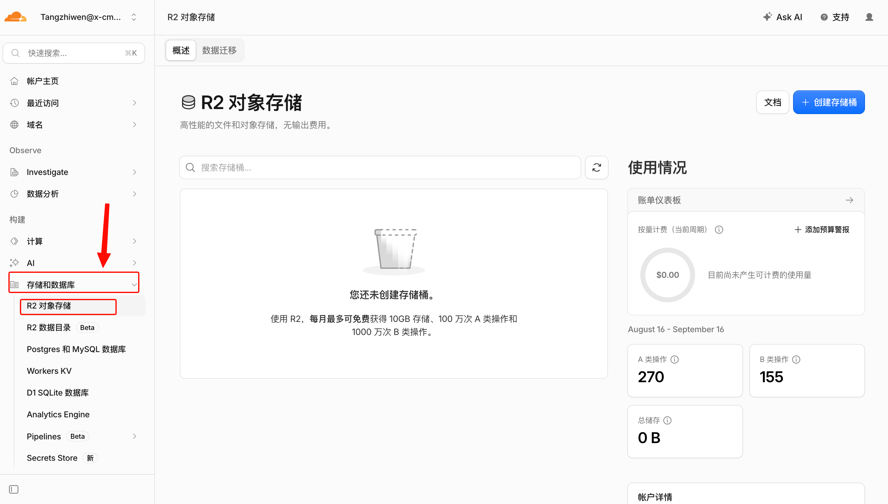
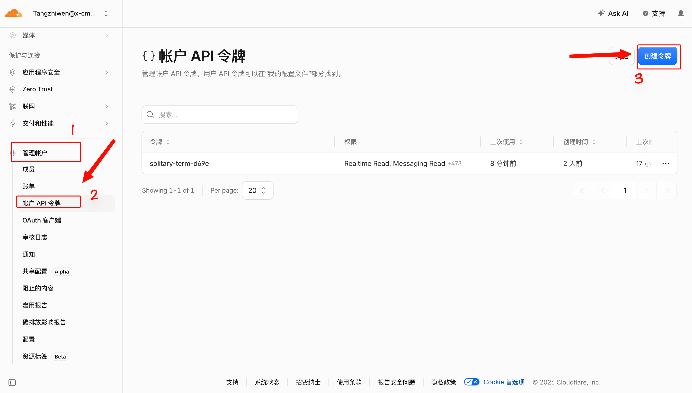
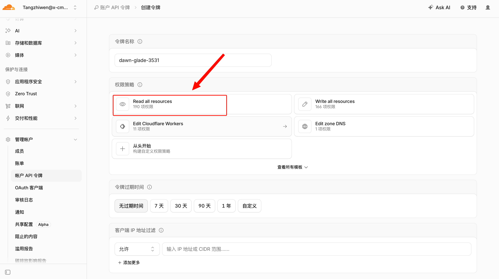

# x-hub 私有化部署

x-hub 是 [x-cmd](https://x-cmd.com) 的云同步与分享服务（文件 / 数据 / AI 技能）。把 x-hub 后端 + 前端一键部署到你自己的 Cloudflare 账号，数据完全在你的 CF 账号内（D1 / R2 / KV）。

---

## 一、前置条件

| 条件 | 说明 |
|------|------|
| **Cloudflare 账号** | 免费版即可；资源部署在你自己账号下 |
| **R2 已激活** | 一次性操作，见下方[图解](#激活-r2首次使用必做)；免费额度 10GB 存储/月，够用 |

支持平台：Linux / macOS / **Windows x64**（Windows 需在 [Git Bash](https://git-scm.com) 中运行——安装 x-cmd 即自带；或用 WSL2）。

### 激活 R2（首次使用必做）

部署需要往 R2 对象存储写文件，新账号需先激活它（一次性，之后不用再管）：

1. 登录 [dash.cloudflare.com](https://dash.cloudflare.com)，左侧导航点击 **存储和数据底座 → R2 对象存储**
2. 若提示需要先**登记付款方式**（绑定信用卡/支付宝即可），先完成绑定——这是 Cloudflare 的实名要求，**免费额度 10GB 存储 + 每月 100 万次 A 类操作，正常使用不产生费用**
3. 按页面提示确认激活/订阅 R2，看到如下页面即成功（**不用手动创建存储桶**，部署器会自动创建）：



> 找不到入口？确认登录的是 [dash.cloudflare.com](https://dash.cloudflare.com)（控制台），且左侧导航展开的是「存储和数据底座」分组。

## 二、快速开始

**方式 A：一行命令**

```bash
curl -fsSL https://raw.githubusercontent.com/x-cmd-hub/x-hub/main/deploy.sh | bash
```

**方式 B：手动下载 Release**

到 [Releases](../../releases) 页面下载对应平台的包（`vX.Y.Z_<os>_<arch>.tar.gz`；Windows 为 `windows_amd64`），然后：

```bash
shasum -a 256 -c vX.Y.Z_darwin_arm64.tar.gz.sha256   # 校验（可选；Linux 用 sha256sum -c）
tar -xzf vX.Y.Z_<os>_<arch>.tar.gz && cd vX.Y.Z
bash deploy.sh                                        # 或直接 ./x-hub-deployer deploy
```

Windows 手动方式（PowerShell，Win10+ 自带 tar）：解压后在包目录运行 `.\x-hub-deployer.exe deploy`；推荐还是用 Git Bash 跑 `bash deploy.sh`，交互体验一致。

deploy.sh 支持的环境变量：`INSTALL_DIR=./cf-hub-deploy`（安装目录）、`TAG=`（指定版本，默认最新）。

### 在容器 / 虚拟机 / 无浏览器环境部署（headless）

正常部署时脚本会自动唤起浏览器完成 Cloudflare 授权（`wrangler login`）；但容器 / 虚拟机 / 服务器里没有浏览器，这一步走不通，需要改用 **API Token** 认证。以下 4 步在**任何一台有浏览器的电脑**上操作一次即可：

**第 1 步：打开令牌管理页**

登录 [dash.cloudflare.com](https://dash.cloudflare.com) → 左侧导航 **管理帐户 → 帐户 API 令牌** → 点击右上角 **创建令牌**：



**第 2 步：选择「创建自定义令牌」**

页面顶部是官方模板列表，**往下翻**找到 **创建自定义令牌（Create Custom Token）→ 开始使用**。给令牌起个名字（如 `x-hub-deploy`）。

**第 3 步：添加权限（共 5 条，逐条添加）**

在 Permissions 区块点击下拉框，按下表**逐条**添加（前三段选 `帐户`，最后一条仅使用自定义域名时需要）：

| # | 第一列（作用范围） | 第二列（资源） | 第三列（操作） |
|---|---|---|---|
| 1 | 帐户 | Workers Scripts | 编辑 |
| 2 | 帐户 | Workers KV Storage | 编辑 |
| 3 | 帐户 | R2 存储（Workers R2 Storage） | 编辑 |
| 4 | 帐户 | D1 | 编辑 |
| 5 | 帐户 | Cloudflare Pages | 编辑 |
| 6（可选） | 区域 | Workers 路由（Workers Routes） | 编辑 |

> 少了任何一条都会导致对应部署步骤报权限错误（比如缺 D1 会建不了数据库）。Token 只部署用、不写代码，**不需要**「Read/Write all resources」这类全量权限。



**第 4 步：生成并复制 Token**

过期时间保持默认（或按需收紧）→ 拉到底 **继续以显示摘要 → 创建令牌** → **立即复制 Token（只显示这一次）**。然后在容器 / 虚拟机里：

```bash
export CLOUDFLARE_API_TOKEN=<你的token>
curl -fsSL https://raw.githubusercontent.com/x-cmd-hub/x-hub/main/deploy.sh | bash
# 或已解压好包：./x-hub-deployer --non-interactive --yes deploy
```

CI 一行直通（deploy.sh 在无终端时零交互、自动选最新版本）。

Token 泄漏等同于账号权限泄漏，用完可随时回到令牌管理页 Roll（轮换）或 Delete。

## 三、部署后验证

```bash
# 后端健康检查（地址在部署完成时打印）
curl https://<worker-url>/ping
# 应返回 {"ping":"pong"}

# 前端：浏览器打开部署完成时打印的 Pages 地址
```

## 四、自定义配置

部署前可编辑包内的 `deploy.conf`（改完再跑 `./x-hub-deployer deploy` 生效）：

| 配置项 | 默认值 | 说明 |
|--------|--------|------|
| `WORKER_NAME` | `hub` | 后端 Worker 服务名（小写字母/数字/连字符） |
| `SHARE_DOMAIN` | 空 | 托管在 CF 的根域；留空 = 部署时询问 |
| `PAGES_PROJECT` | 空 | 前端 Pages 项目名；留空 = 部署时询问（默认 `x-hub-web`） |
| `TRAFFIC_LIMIT_BYTES` | `1073741824` | 每用户月流量上限（1GB） |
| `R2_BUCKET` | `x-hub-files` | R2 桶名（同名自动复用已有桶） |
| `D1_NAME` | `x-hub-db` | D1 数据库名（同名自动复用已有库） |

### 关于域名（SHARE_DOMAIN）

**为什么要配置域名**：唯一影响的功能是**子域名分享**——配置后每个用户拥有 `用户名.你的域名` 形式的专属分享主页（如 `alice.example.com`）。这需要给 Worker 绑定 `*.域名` 的通配路由，只有托管在 Cloudflare 的自有域名才能做到，`workers.dev` 不支持。此外自有域名地址更干净（`api.域名` / `hub.域名`），且不依赖 `workers.dev` / `pages.dev` 这类公共域名（部分网络环境下访问受限）。

**没有域名会怎么样**：完全可用。后端跑在 `<worker>.workers.dev`，前端跑在 `<项目名>.pages.dev`，同步、文件、路径分享 `/s/:id` 等核心功能全部正常，仅子域名分享不可用。以后买了域名，托管到 Cloudflare 后改 `SHARE_DOMAIN` 重跑 `./x-hub-deployer deploy` 即可启用。

**有域名**：先把域名托管到 Cloudflare（控制台 Add a Site，按提示把注册商的 nameserver 改成 CF 分配的地址），再在 `SHARE_DOMAIN` 填根域，部署脚本会自动配置通配路由和子域地址。

## 五、升级

从 [Releases](../../releases) 下载新版 tarball，解压后进入新目录重跑：

```bash
tar -xzf vX.Y.Z_<os>_<arch>.tar.gz
cd vX.Y.Z
./x-hub-deployer deploy   # 或 bash deploy.sh；检测到已部署 Worker 后选「更新代码」即可，数据全保留
```

新目录没有旧配置没关系：脚本会自动找到你账号里的已有部署并复用全部资源。

## 六、常见问题

**CORS 跨域报错**
检查部署目录 `wrangler.toml` 的 `ALLOWED_ORIGINS` 是否包含前端域名，缺了就补上后重跑 `./x-hub-deployer deploy`。

**邮件验证链接 404**
检查 `grep FRONT_END_URL wrangler.toml`，应为 `https://<pages-project>.pages.dev`（前端地址，不是 API 地址）；不对则改正后重跑 `./x-hub-deployer deploy`。

**R2 报 10042 / enable R2**
你的 CF 账号还没激活 R2：控制台 → R2 Object Storage → 激活后重跑 `./x-hub-deployer deploy`。

---

## 支持与反馈

- 问题反馈：[Issues](../../issues)
- 更多文档见部署包内 `deploy/docs/` 与 `docs/`
